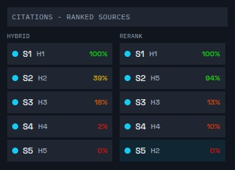
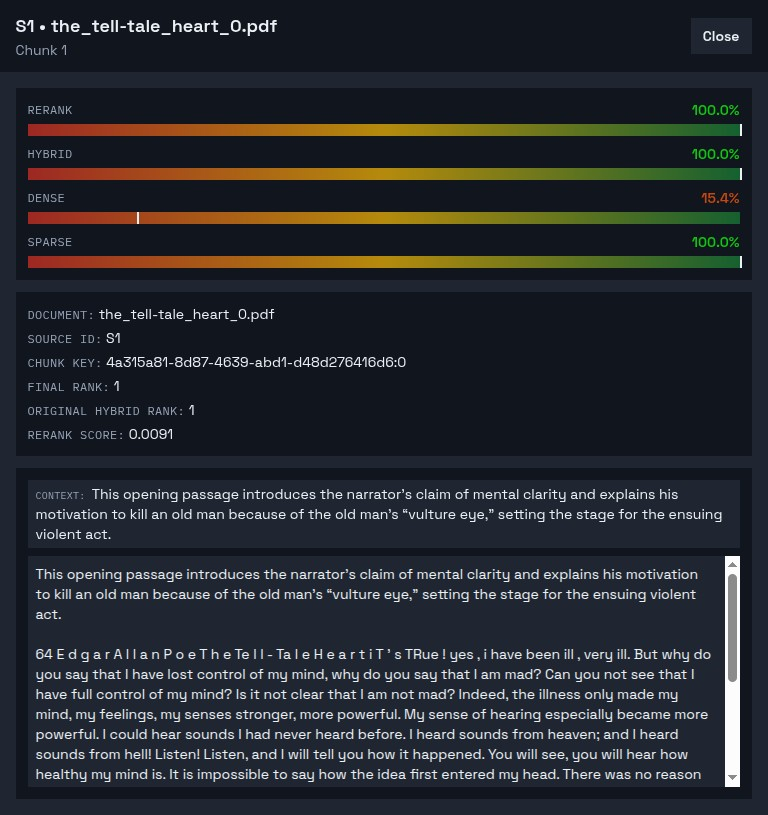
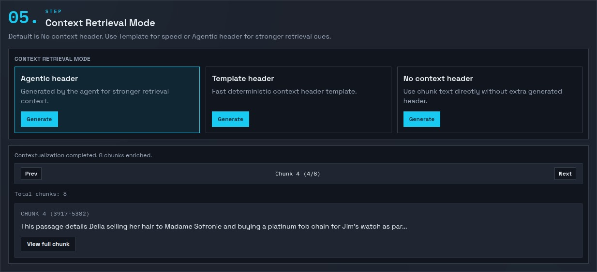
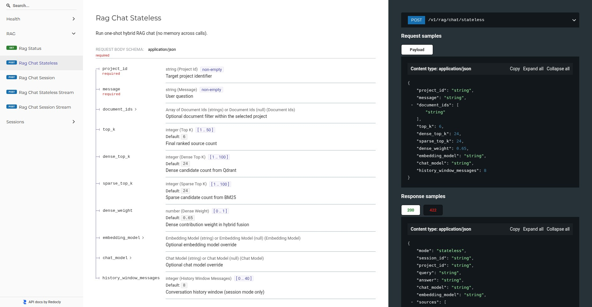
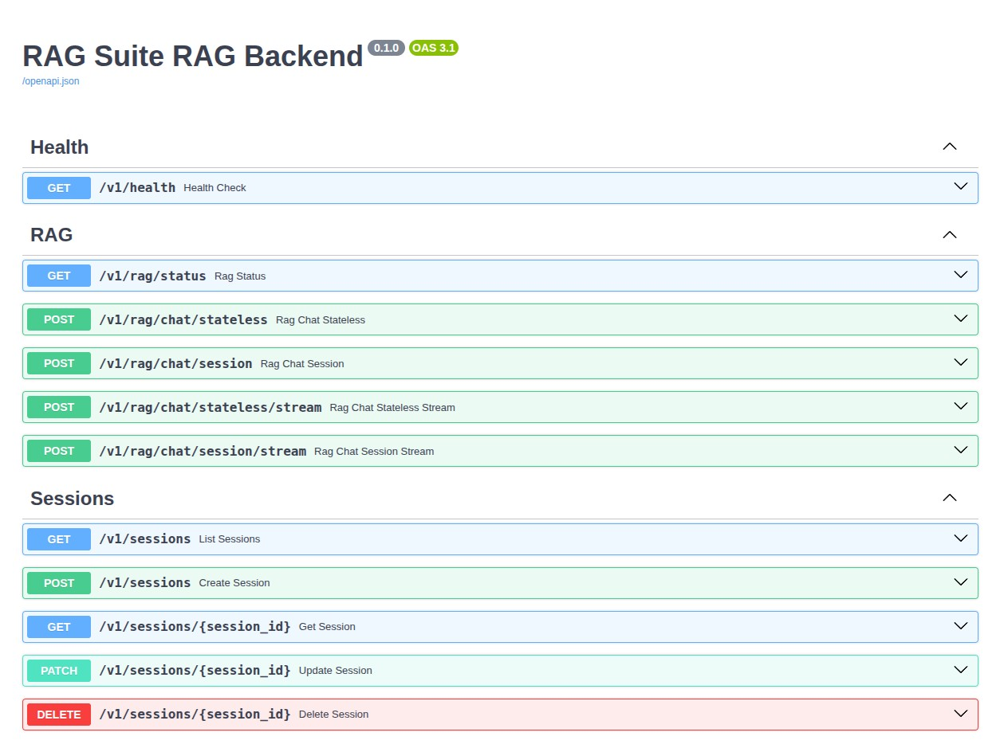

# RAG Suite


Production-focused RAG platform with a quality-first ingestion + retrieval pipeline.

## Highlights

Built for teams that need production-grade RAG quality, not a toy demo.

- 4 isolated backends (`inference`, `ingestion`, `rag`, `reranker`) with clean contracts.
- OpenAI-style inference gateway (`/v1/chat/completions`, `/v1/completions`, `/v1/embeddings`, `/v1/rerank`) for local, cloud, or hybrid model routing.
- Plug-and-play ingestion as a dedicated system: HITL mode for precision workflows + automated mode for full-speed batch pipelines.
- Two retrieval modes implemented end-to-end:
  - Hybrid RAG (`dense + sparse/BM25`)
  - Hybrid + Re-ranked RAG (candidate pool -> cross-encoder rerank -> grounded generation)
- Every backend ships with its own OpenAPI + ReDoc surface for independent integration.

## Product Snapshots

`Hybrid vs Re-rank` source ordering and score behavior:



`Re-rank` source inspection popup (rerank/dense/sparse/hybrid signals):



Contextual retrieval stage with chunk-by-chunk navigation and control:



Per-service ReDoc documentation:



Per-service OpenAPI documentation:



## Current Scope

Stage 0 data preparation control plane (complete):

- Deterministic text normalization (no model rewriting)
- Deterministic chunking and experimental agentic chunk boundary proposals
- Context-aware retrieval headers (Anthropic-style contextual retrieval pattern)
- Embedding and vector indexing in Qdrant
- SQLite metadata registry for projects, documents, and chunk audit records
- OpenAPI backend for step-by-step and one-shot ingestion workflows
- Automatic pipeline preview endpoint for human review before persistence
- Frontend ingestion shell with PDF/DOCX/TXT extraction, diff review, and manual or automatic execution controls

Stage 1 baseline RAG (implemented):

- Hybrid retrieval (`dense + sparse/BM25`) on project-scoped data
- Stateless and session-memory chat endpoints in `backend_rag`
- Persistent session snapshot store in `backend_rag` (`create/list/get/update/delete`)
- Ordered source tracing (`document + chunk + score`) in every chat response

Stage 2 reranked RAG (implemented):

- Isolated reranked pipeline (`hybrid candidate generation -> reranker -> grounded generation`)
- Dedicated reranked endpoints under `/v1/rag/reranked/*`
- Dedicated reranked session store under `/v1/reranked/sessions/*`
- Side-by-side source lineage (`hybrid candidates` vs `final reranked sources`)
- Dedicated reranker backend (`backend_reranker`) for stable `/v1/rerank` scoring outside Ollama

Service split (active):

- `backend_inference`: OpenAI-compatible inference API (the only service that calls Ollama directly for chat/completions/embeddings)
- `backend_reranker`: dedicated cross-encoder reranker backend
- `backend_ingestion`: ingestion/vectorization API
- `backend_rag`: hybrid RAG chat API + persistent session store

## Why Qdrant (and not FAISS-only)

FAISS is an excellent vector search library, but this project needs production database capabilities from day one (metadata filtering, persistence, API layer, and operational controls). Qdrant provides those as a full open-source vector database while still supporting high-performance ANN retrieval.

FAISS is kept as a future benchmark/tuning path, not as the primary persistence and API layer.

## Service Topology

Current runtime chain:

- `ollama` -> `backend_inference` -> (`backend_ingestion` and `backend_rag`)
- `backend_rag` -> `backend_inference /v1/rerank` -> `backend_reranker`

This keeps model access centralized behind one inference API so cloud model providers can be swapped later without
rewiring ingestion/RAG business logic.

## Architecture Rationale (Stage 0)

- Keep `raw_text` immutable for auditability.
- Apply deterministic normalization before chunking to avoid model-induced text drift.
- Run chunk proposal as deterministic by default; keep agentic boundaries as optional experimental mode.
- Generate contextual headers as an additive step before embedding.
- Store control-plane metadata in SQLite and vectors in Qdrant.
- Expose every stage via OpenAPI so manual and automatic modes share the same contracts.

## Repository Layout

```text
backend_ingestion/  FastAPI ingestion API + SQLite control plane + Qdrant adapters
backend_inference/  FastAPI OpenAI-compatible inference API (Ollama gateway)
backend_reranker/   FastAPI dedicated cross-encoder reranker backend
backend_rag/        FastAPI hybrid RAG API + persistent session store
frontend/           React ingestion UI shell
ollama/             ROCm Ollama startup scripts
qdrant/             Local persistent Qdrant storage mount point (`qdrant/storage`)
samples/            Sample PDF/TXT files for ingestion and extraction tests
docker-compose.yml  Local stack orchestration
.env.template       Environment and host-path template
```

## Sample Data

`samples/` contains small real files used to test source loading and extraction paths:

- PDF load/extraction behavior (`.pdf`)
- Plain text load behavior (`.txt`)
- Formatting cleanup behavior in normalization (PDF-derived noisy text patterns)

Current included samples:

- `samples/andersen_little_match_girl.pdf`
- `samples/the_tell-tale_heart_0.pdf`
- `samples/the_gift_of_the_magi.txt`

## Quick Start

1. Copy environment template:

```bash
cp .env.template .env
```

2. Update host paths in `.env`.
   Keep `OLLAMA_MODELS_DIR` absolute (persistent model cache).
   `QDRANT_STORAGE_DIR` and `DATA_DIR` can stay relative (defaults in template).
   The `.env.template` paths are placeholders by design; run compose with your real `.env`.

3. Start stack:

```bash
docker compose --env-file .env up -d --build
```

4. Open:

- Frontend: `http://localhost:5173`
- Ingestion backend docs: `http://localhost:8000/docs`
- Inference backend docs: `http://localhost:8010/docs`
- Reranker backend docs: `http://localhost:8030/docs`
- RAG backend docs: `http://localhost:8020/docs`
- Qdrant: `http://localhost:6333/dashboard`

## Persistent Paths

- `.env.template` keeps `OLLAMA_MODELS_DIR` as an absolute placeholder.
- `QDRANT_STORAGE_DIR=./qdrant/storage` and `DATA_DIR=./data` work as repository-relative defaults.
- `RAG_SESSIONS_DATABASE_URL` defaults to `sqlite:///./data/rag_sessions.db` (persistent chat session snapshots).
- `RAG_RERANKED_CHECKPOINT_PATH` defaults to `./data/rag_reranked_memory_checkpoints.db` (reranked memory graph checkpoints).
- `RERANKER_CACHE_DIR` defaults to `./data/reranker_cache` (persistent Hugging Face model cache for dedicated reranker backend).
- Set `OLLAMA_MODELS_DIR` to your persistent local model store (for example `/home/.../models/ollama` in your real `.env`).

## Backend Endpoints

`backend_inference` (port `8010`):

- `GET /v1/health`
- `POST /v1/chat/completions`
- `POST /v1/completions`
- `POST /v1/embeddings`
- `POST /v1/rerank`

`backend_ingestion` (port `8000`):

- `GET /v1/health`
- `POST /v1/projects`
- `GET /v1/projects`
- `DELETE /v1/projects/{project_id}`
- `GET /v1/projects/{project_id}/documents`
- `GET /v1/projects/documents/{document_id}/chunks`
- `POST /v1/pipeline/normalize`
- `POST /v1/pipeline/chunk`
- `POST /v1/pipeline/contextualize`
- `POST /v1/pipeline/operations/{operation_id}/cancel`
- `POST /v1/pipeline/preview-automatic`
- `POST /v1/projects/{project_id}/documents/ingest`

`backend_reranker` (port `8030`):

- `GET /v1/health`
- `POST /v1/rerank`

`backend_rag` (port `8020`):

- `GET /v1/health`
- `GET /v1/rag/status`
- `POST /v1/rag/chat/stateless`
- `POST /v1/rag/chat/session`
- `POST /v1/rag/chat/stateless/stream` (SSE)
- `POST /v1/rag/chat/session/stream` (SSE)
- `GET /v1/sessions`
- `POST /v1/sessions`
- `GET /v1/sessions/{session_id}`
- `PATCH /v1/sessions/{session_id}`
- `DELETE /v1/sessions/{session_id}`
- `GET /v1/rag/reranked/status`
- `POST /v1/rag/reranked/chat/stateless`
- `POST /v1/rag/reranked/chat/session`
- `POST /v1/rag/reranked/chat/stateless/stream` (SSE)
- `POST /v1/rag/reranked/chat/session/stream` (SSE)
- `GET /v1/reranked/sessions`
- `POST /v1/reranked/sessions`
- `GET /v1/reranked/sessions/{session_id}`
- `PATCH /v1/reranked/sessions/{session_id}`
- `DELETE /v1/reranked/sessions/{session_id}`

## OpenAI-Compatible Inference (Ollama-backed)

These endpoints are exposed by `backend_inference` and follow OpenAI-style request/response shapes:

- `POST /v1/chat/completions`
- `POST /v1/completions`
- `POST /v1/embeddings`
- `POST /v1/rerank`

`POST /v1/rerank` now delegates to `backend_reranker` (cross-encoder scoring), avoiding Ollama rerank API limitations while keeping a stable inference contract.

Example:

```bash
curl -sS http://localhost:8010/v1/chat/completions \
  -H "content-type: application/json" \
  -d '{
    "model":"gpt-oss:20b",
    "messages":[{"role":"user","content":"Reply with one word: hello"}],
    "temperature":0,
    "stream":false
  }'
```

## Incremental Roadmap

1. Stage 0: data preparation and indexing control plane (complete)
2. Stage 1: hybrid RAG baseline backend (complete)
3. Stage 2: reranked retrieval branch (complete)
4. Stage 3: quality benchmark harness (Recall@k, MRR, nDCG)
5. Stage 4: graph-augmented retrieval branch (Knowledge Graph / LightRAG)

## Frontend Workflow

The ingestion UI in `frontend/` supports:

- `Start` guide screen with cold-start checklist and execution modes
- Upload and browser-side extraction from `.pdf`, `.docx`, and `.txt`
- Raw text review and editing
- Deterministic normalization with diff visualization
- Deterministic or agentic chunk proposal review
- Context-aware retrieval header generation and manual edit
- Interrupt controls for long-running agentic chunk/context operations
- Stage-level error reporting for chunking/contextualization failures
- Manual ingest (approved chunks) or full automatic ingest
- `Projects` table with document/chunk stats, flag summaries, delete action, and chunk lineage explorer popup

Hybrid RAG UI (`RAG Mode -> Hybrid`) now supports:

- Stateless and session-memory chat modes
- Persistent session sidebar (load on refresh, create, delete)
- Project-scoped queries with optional per-document filter
- True token streaming path (`backend_inference` SSE -> `backend_rag` SSE -> frontend chat panel)
- Separated source trace panel (citations, documents, ranked chunk bullets, and full source preview)

Reranked RAG UI (`RAG Mode -> Hybrid + Re-ranked`) now supports:

- Isolated session sidebar and persistent session lifecycle
- Retrieval settings with rerank candidate-pool and reranker-model override
- True token streaming path (`backend_inference` SSE -> `backend_rag` SSE -> frontend chat panel)
- Side-by-side source panel:
  - pre-rerank hybrid candidates
  - final reranked cited sources (with rank movement and score gauges)

## Audit Example (PDF-Derived TXT)

Document used: `data/2512.10398v6.txt` (generated from a PDF extraction).

Audit report: `docs/audits/2026-02-21-2512.10398v6-section-audit.md`

Key results from the 2026-02-21 run:

- Full-file normalization:
  - `source_chars=92812`
  - `normalized_chars=91393`
  - `removed_repeated_line_count=142`
  - `collapsed_whitespace_count=11224`
- Repeated marker cleanup (`<SYSTEM>`, `Agent`, `<AI>`, `Output:`) dropped to `0` occurrences after normalization.
- Deterministic chunking (section-level, `max=550`, `min=180`, `overlap=80`) produced `3` chunks: `[456, 219, 522]`.
- Agentic chunking on the same section (`gpt-oss:20b`) produced `3` chunks: `[445, 576, 165]` with semantic rationales per boundary.
- Audit finding: the agentic pass can violate size constraints (here `165 < min=180`), so manual review or post-validation remains required.

Reproduce the deterministic audit:

```bash
UV_CACHE_DIR=/tmp/uv-cache uv run --directory backend_ingestion python -m scripts.run_section_audit \
  --input-file data/2512.10398v6.txt \
  --section-anchor Introduction \
  --section-length 1200 \
  --max-chars 550 \
  --min-chars 180 \
  --overlap-chars 80
```

## Backend Verification

```bash
UV_CACHE_DIR=/tmp/uv-cache uv run --directory backend_ingestion pytest -q tests
UV_CACHE_DIR=/tmp/uv-cache uv run --directory backend_inference pytest -q tests
UV_CACHE_DIR=/tmp/uv-cache uv run --directory backend_reranker pytest -q tests
UV_CACHE_DIR=/tmp/uv-cache uv run --directory backend_rag pytest -q tests
```

## ROCm Stability Notes

If Ollama logs include messages like `Memory access fault by GPU` or the desktop briefly blanks:

- Keep `OLLAMA_NUM_PARALLEL=1`.
- Keep `OLLAMA_MAX_LOADED_MODELS=1`.
- Keep `OLLAMA_KEEP_ALIVE=0s` to force per-request unload.
- Keep `RERANK_UNLOAD_AFTER_REQUEST=true` to release cross-encoder GPU memory after each rerank call.
- Keep `OLLAMA_CONTEXT_LENGTH=8192` (or lower for extra stability).
- Keep `OLLAMA_TIMEOUT_SECONDS=300` and `INFERENCE_TIMEOUT_SECONDS=300` for long agentic operations.
- Use `Interrupt` in chunk/context steps to stop in-flight LLM work.
- If failures persist, test a smaller chat model for chunk/context operations.
